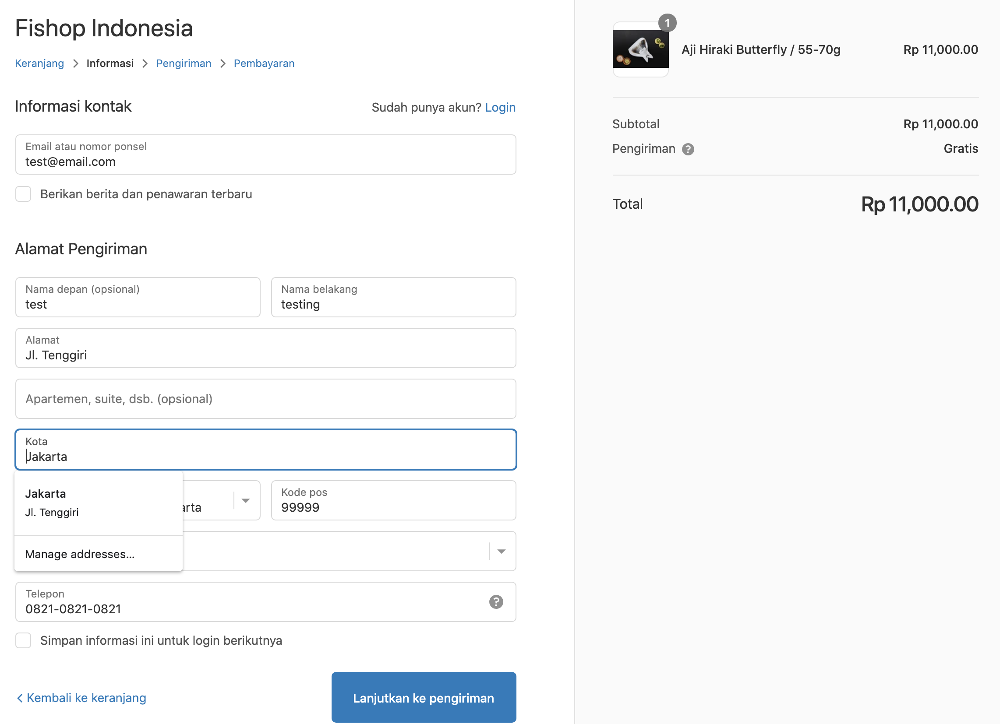

# Fishop Shipping
## Description
Automatic rate and shipping feature for a shopify web

## Case(s)
Change manual process of delivery rate to automatic, based on option selected in a new custom ordering-form

## Delivery Policy
Jakarta Area:
- Free delivery untuk order-an mulai dari Rp 750,000
- Standard Shipping (Rp 15,000) untuk order-an mulai dari Rp 150,000
Bogor, Bekasi & Tangerang Area:
- Free delivery untuk order-an mulai dari Rp 2,000,000
- Standard Shipping (Rp 40,000) untuk order-an mulai dari Rp 400,000

## Problem Preview

## Task(s)
- [ ] Create backend stuf with Node.js
- [ ] React frontend can be hosted on Firebase-hosting
- [ ] Host on Heroku for testing
- [ ] Create database with Postgres
- [ ] Integrate with Rajaongkir API
